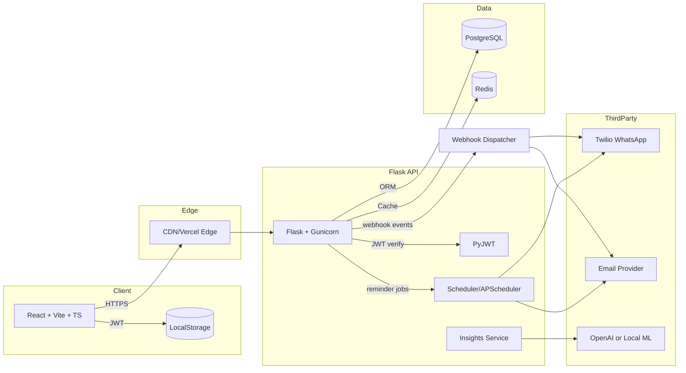

# FinMind — AI-Powered Budget & Bill Tracking

FinMind helps users control spending, track bills, and get smart financial insights. Built for free-tier friendly deployment with scalable architecture.

## System Architecture



## PostgreSQL Schema (DDL)
See `backend/app/db/schema.sql`. Key tables:
- users, categories, expenses, bills, reminders
- `webhook_endpoints`, `webhook_delivery_attempts` (for event system)
- ad_impressions, subscription_plans, user_subscriptions
- refresh_tokens (optional if rotating), audit_logs

## Redis Caching Policy
- Keys
  - `user:{id}:monthly_summary:{yyyy-mm}` — 30 min TTL
  - `user:{id}:categories` — 24h TTL
  - `user:{id}:upcoming_bills` — 15 min TTL
  - `insights:{id}` — 24h TTL (invalidate on new expense/bill)
- Invalidation
  - On expense/bill create/update/delete -> delete affected monthly_summary, upcoming_bills, insights
- Rate limiting (optional): `rl:{userId}:{endpoint}:{minute}` with short TTL

## API Endpoints
OpenAPI: `backend/app/openapi.yaml`
- Auth: `/auth/register`, `/auth/login`, `/auth/refresh`
- Expenses: CRUD `/expenses`
- Bills: CRUD `/bills`, pay/mark `/bills/{id}/pay`
- Reminders: CRUD `/reminders`, trigger `/reminders/run`
- Insights: `/insights/monthly`, `/insights/budget-suggestion`
- Webhooks:
  - `/webhooks/endpoints` (POST to create, GET to list)
  - `/webhooks/endpoints/{id}` (GET, PUT, DELETE)
  - `/webhooks/endpoints/{id}/rotate-secret` (POST to generate new secret)
  - `/webhooks/endpoints/{id}/delivery-attempts` (GET to view recent delivery attempts)

## MVP UI/UX Plan
- Auth screens: register/login.
- Dashboard:
  - Monthly spend chart, category breakdown donut.
  - Upcoming bills list with due dates and pay status.
  - AI budget suggestion card.
- Expenses page: add expense (amount, category, notes, date), list & filter.
- Bills page: create bill (name, amount, cadence, due date, channel), toggle WhatsApp/email.
- Settings: profile, categories, reminders default channel, export (premium).

## Monetization Plan
- Free: ads in dashboard and list pages (lightweight, non-intrusive). Record impressions in `ad_impressions`.
- Premium ($/mo): CSV/Excel export, multi-device sync, priority insights, remove ads.
- Payments stubbed; swap in Stripe when moving off free tier.

## Organic Marketing Strategies
- Content: budgeting tips, “FinMind monthly challenge” on socials.
- SEO: landing with calculators (50/30/20, debt snowball), schema markup.
- Communities: Reddit PF, indie hackers build-in-public.
- Referral: give 1 month premium for inviting 3 friends.

## Project Structure
```
finmind/
  backend/
    app/
      __init__.py
      config.py
      extensions.py
      models.py
      routes/
        __init__.py
        auth.py
        expenses.py
        bills.py
        reminders.py
        insights.py
      services/
        __init__.py
        ai.py
        cache.py
        reminders.py
      db/
        schema.sql
      openapi.yaml
    wsgi.py
    requirements.txt
    Dockerfile
  frontend/
    index.html
    src/
      main.tsx
      App.tsx
      components/
        AdBanner.tsx
        Charts.tsx
      pages/
        Dashboard.tsx
        Expenses.tsx
        Bills.tsx
        Settings.tsx
    package.json
    tsconfig.json
    vite.config.ts
    Dockerfile
  .github/
    workflows/
      ci.yml
  docker-compose.yml
  .env.example
```

## Deployment
- Backend: Dockerized Flask to Railway/Render free tier (Postgres & Redis managed or via Compose locally).
- Frontend: Vercel.
- Secrets: use environment variables (.env locally, platform secrets in cloud).
- Kubernetes manifests for full stack deployment are available in `deploy/k8s/`.

## Local Development
1) Prereqs: Docker, Docker Compose, Node 20+, Python 3.11+
2) Copy env: `cp .env.example .env` and fill secrets
3) Start: `docker compose up --build`
4) Frontend at http://localhost:5173, Backend at http://localhost:8000
5) Observability stack (dev compose) is included:
   - Grafana: http://localhost:3000
   - Prometheus: http://localhost:9090
   - Loki: http://localhost:3100
   - Nginx proxy: http://localhost:8080 (status at `/nginx_status`)

### Backend Test Runner (No local pytest setup required)
- PowerShell (Windows):
  - `./scripts/test-backend.ps1`
  - single file: `./scripts/test-backend.ps1 tests/test_dashboard.py`
- POSIX shell:
  - `sh ./scripts/test-backend.sh`
  - single file: `sh ./scripts/test-backend.sh tests/test_dashboard.py`

## Testing & CI
- Backend: pytest, flake8, black. Frontend: vitest, eslint.
- GitHub Actions `ci.yml` runs lint, tests, and builds both apps; optional docker build.

## Webhook Event System
FinMind can emit signed webhook events to external systems, enabling real-time integrations and automation.

### Available Event Types
-   `expense.created`: A new expense has been added.
-   `expense.updated`: An existing expense has been modified.
-   `expense.deleted`: An existing expense has been deleted.
-   `bill.created`: A new bill has been added.
-   `bill.updated`: An existing bill has been modified.
-   `bill.deleted`: An existing bill has been deleted.
-   `bill.paid`: A bill has been marked as paid.

### Payload Structure
All webhook events are sent as `application/json` with the following common structure:
```json
{
  "id": "event_uuid_v4",          // Unique ID for this specific event instance
  "event_type": "expense.created", // Type of the event
  "timestamp": "2023-10-27T10:30:00.123456", // UTC timestamp in ISO 8601 format
  "data": { /* resource object (e.g., Expense, Bill) in its current state */ },
  "metadata": {
    "finmind_app_id": "finmind_backend"
  }
}
```

### Signed Delivery (Signature Verification)
To ensure the authenticity and integrity of webhook payloads, each request is signed using an HMAC-SHA256 algorithm.

1.  **Secret Key**: Each webhook endpoint configured by the user has a unique secret key. This key is provided once when the endpoint is created or when its secret is rotated. **It should be stored securely and not shared.**
2.  **Signature Header**: The webhook request includes an `X-FinMind-Signature` header in the format `t=<timestamp>,v1=<signature>`.
    *   `t`: The UTC timestamp (seconds since epoch) when the webhook was sent.
    *   `v1`: The HMAC-SHA256 signature.
3.  **Verification Steps (on receiver's end)**:
    *   Extract the `timestamp` and `signature` from the `X-FinMind-Signature` header.
    *   **Concatenate the timestamp and the raw request body**: `signed_payload = f"{timestamp}.{request_body_string}"`.
    *   Compute an HMAC with SHA256 using your endpoint's `secret` as the key and the `signed_payload` as the message.
    *   Compare the computed signature with the `v1` signature from the header. If they match, the webhook is authentic.
    *   **Timestamp Verification (optional but recommended)**: Compare the `timestamp` from the header with the current time. If the difference is too large (e.g., more than 5 minutes), reject the request to prevent replay attacks.

Example Python verification:
```python
import hmac
import hashlib
import time
import json

def verify_webhook_signature(payload_body, header_signature, secret, tolerance=300):
    try:
        parts = header_signature.split(',')
        timestamp_part = next(p for p in parts if p.startswith('t='))
        signature_part = next(p for p in parts if p.startswith('v1='))
        
        timestamp = int(timestamp_part.split('=')[1])
        signature = signature_part.split('=')[1]

        # Check timestamp for replay attacks
        if abs(time.time() - timestamp) > tolerance:
            return False, "Timestamp too old or too new"

        signed_payload = f"{timestamp}.{payload_body}"
        expected_signature = hmac.new(
            secret.encode('utf-8'),
            signed_payload.encode('utf-8'),
            hashlib.sha256
        ).hexdigest()

        return hmac.compare_digest(expected_signature, signature), None
    except Exception as e:
        return False, str(e)

# Example usage (assuming Flask request):
# webhook_secret = "your_endpoint_secret"
# payload_body = request.get_data(as_text=True)
# header_signature = request.headers.get('X-FinMind-Signature')
# is_valid, error = verify_webhook_signature(payload_body, header_signature, webhook_secret)
# if not is_valid:
#     print(f"Webhook verification failed: {error}")
#     return "Unauthorized", 401
```

### Retry & Failure Handling
FinMind implements a robust retry mechanism for webhook deliveries:
-   **Initial Attempt**: Webhooks are dispatched shortly after an event occurs.
-   **Retry Policy**: If a delivery fails (e.g., non-2xx HTTP status, network error, timeout), FinMind will retry the delivery multiple times using an exponential backoff strategy.
    *   Default initial delay: 1 minute
    *   Default backoff factor: 2 (e.g., 1m, 2m, 4m, 8m, ...)
    *   Default max attempts: 5
-   **Persistence**: Retry attempts are stored in the database and managed by `APScheduler`, ensuring that retries persist across application restarts.
-   **Failure Logging**: All delivery attempts and their outcomes (status code, error messages) are logged and can be viewed via the `/webhooks/endpoints/{id}/delivery-attempts` API. If all retries are exhausted, the delivery is marked as failed.

### Webhook Management API
Users can manage their webhook endpoints through dedicated API routes:
-   **Create**: `POST /webhooks/endpoints` to register a new URL and event types. A unique secret is generated and returned.
-   **List**: `GET /webhooks/endpoints` to view all configured endpoints.
-   **Update**: `PUT /webhooks/endpoints/{id}` to modify endpoint details (URL, event types, active status).
-   **Rotate Secret**: `POST /webhooks/endpoints/{id}/rotate-secret` to generate a new secret key for an endpoint.
-   **Delete**: `DELETE /webhooks/endpoints/{id}` to remove an endpoint.
-   **Delivery Attempts**: `GET /webhooks/endpoints/{id}/delivery-attempts` to review recent delivery logs.

## Monitoring (Grafana OSS)
- Backend exposes Prometheus metrics at `/metrics` with:
  - request count by endpoint/status
  - request duration histograms (latency, including dashboard p95 KPI)
  - reminder event counters (engagement KPI)
  - webhook delivery attempt counters (success/failure KPIs)
- Logs are emitted as JSON with `request_id` and shipped to Loki via Promtail.
- Pre-provisioned Grafana dashboard: `FinMind Operations and KPI`.

## Contribution Policy
- See `CONTRIBUTING.md` for fork-first contribution flow and PR requirements.

## Notes on Free-Tier Reminders
- Primary: schedule via APScheduler in-process with persistence in Postgres (job table) and a simple daily trigger. Alternatively, use Railway/Render cron to hit `/reminders/run`.
- Twilio WhatsApp free trial supports sandbox; email via SMTP (e.g., SendGrid free tier).

## Security & Scalability
- JWT access/refresh, secure cookies OR Authorization header.
- RBAC-ready via roles on `users.role`.
- N+1 avoided via SQLAlchemy eager loading.
- Redis caching for hot paths to cut DB load.
- 12-factor app env config; stateless API.

---

MIT Licensed. Built with ❤️.
